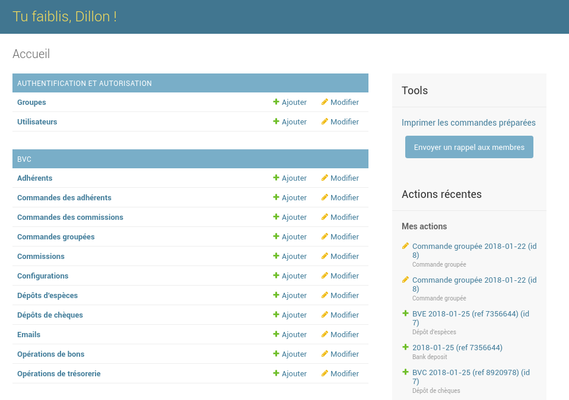
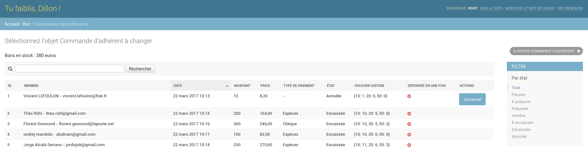

# Documentation de l'application

## Vue générale de l'organisation

La distribution des bons se fait mensuellement et suit le cycle suivant :

1. Les adhérents et commissions passent commande (ces commandes sont dites individuelles)
2. Le 22 du mois, le responsable des bons passe une commande dite groupée auprès du trésorier
3. Quand la commande groupée est prête (en général une semaine après, au début du mois suivant), le responsable la récupère au magasin, notifie les adhérents que leur commande est disponible et prépare les paquets de bons à distribuer
4. Pendant trois semaines (trois permanences), le responsable distribue les paquets
5. Après la dernière permanence du cycle, le responsable annule les commandes individuelles non récupérées et dépose en banque les chèques et espèces récoltés
6. Retour en 2 (les adhérents auront passé commande en parallèle de 3, 4 et 5)

## Vue générale de l'application

L'application comporte deux parties :

* Une destinée aux adhérents et commissions du club, pour passer commande
* Une destinée au trésorier et responsable des bons, pour administrer

La partie d'administration ressemble à ceci :

On distingue à gauche plusieurs types d'entités :

* Commandes des adhérents
* Commandes groupées
* Dépôts de chèques
* ...

Pour chaque type d'entité, trois actions sont généralement possibles :

* Créer une entité de ce type (par exemple, créer une commande groupée) 
* Consulter une entité
* Modifier une entité (par exemple, indiquer qu'un dépôt d'espèces a été fait physiquement)

En cliquant sur un type d'entité, on accède à une page où toutes les entités sont
listées :

Par la suite, nous détaillons comment administrer chaque type d'entité.

## Commandes des adhérents

En théorie, le responsable ne crée jamais de commande adhérent à la main. Tout au
plus, il peut en passer une lui-même via l'interface à destination des adhérents, mais
pas depuis l'interface d'administration.

Une commande d'adhérent comporte plusieurs informations, telles que l'adhérent en
question, le montant en BVC, le prix, etc. Mais surtout, elle comporte un état, qui peut être :

* Passée : le membre a passé la commande
* A préparer : la commande a été incluse dans une commande groupée, un mail a été envoyé à l'adhérent pour lui indiquer que sa commande serait disponible prochainement
* Préparée : la commande groupée correspondante a été reçue, un mail a été envoyé à l'adhérent pour lui indiquer que sa commande est disponible
* Vendue : la commande a été distribuée et payée par chèque
* A encaisser : la commande a été distribuée et soit payée par espèces soit payée par chèque et le chèque a été vérifié par le responsable (bon montant, bon ordre, signé, etc.)
* Encaissée
* Annulée

Il est possible de filtrer les commandes par état via le filtre présent à droite
de la page. Par défaut, toutes les commandes sont affichées. Pour afficher par exemple uniquement
les commandes en cours de distribution, il suffit de cliquer sur "Préparée".

Sur la ligne d'une commande, en plus de certaines de ses propriétés, apparaîssent à
droite un ensemble d'actions possibles, qui permettent de modifier l'état de la commande.
Les actions à faire manuellement sont, pour une commande :

* Passée :
    * Préparer (au cas où il faudrait ajouter manuellement une commande à la distribution du mois. Sinon, les commandes passées avant le 22 sont automatiquement marquées comme préparées quand la commande groupée correspondante a été marqué comme récupérée au magasin)
* Non vendue :
    * Annuler
* Préparée :
    * Vendre par chèque
    * Vendre par espèces
* Vendue par chèque :
    * Ajouter au dépôt (après que le chèque a été vérifié : bon montant, bon ordre, signé par l'adhérent, signé au dos par le responsable BVC)
* Vendue :
    * Annuler la vente (dans le cas où le mauvais type de paiement a été rentré dans l'application)

### Préparer les commandes

Quand la commande groupée a été récupérée au magasin et marquée comme telle (cf. plus bas),
les commandes individuelles (adhérents + commissions) associées (passées avant le 22)
sont marquées comme préparées. Il suffit alors d'imprimer la feuille listant
ces commandes en cliquant sur le lien "Imprimer les commandes préparées" sur la page
d'accueil de l'administration (à droite). Une page s'ouvrira dans votre navigateur et vous pourrez
l'imprimer pour y avoir accès à la permanence.

Pour chaque commande la composition du paquet à préparer est automatiquement calculée,
il suffit donc de suivre ce qui est inscrit sur la feuille.

En outre, chaque commande se voit attribuer un numéro unique allant grosso modo
de 0 au nombre de commandes à distribuer. Quand vous confectionnez un paquet, il
faut lui associer un petit papier avec son numéro pour pouvoir faire la correspondance
avec la commande détaillée sur la feuille.

### Distribuer les commandes

Après chaque permanence, il faut se connecter sur l'interface d'administration pour
marquer comme vendues les commandes préparées qui l'ont été. 

Sur la feuille des commandes préparées, trois colonnes, une par semaine, permettent
d'indiquer si la commande de la ligne a été vendue par chèque ("C") ou espèces ("E"). Quand
un adhérent paie en un chèque plusieurs commandes, il faut penser à le noter sur la feuille
pour ne pas être surpris au moment du dépôt quand on vérifie les chèques.

Astuce : conserver les élastiques et les numéros pour pouvoir les réutiliser le
mois suivant.

Après l'avant-dernière permanence (souvent la seconde) et après avoir rentré
dans l'application les commandes distribuées, il faut envoyer un mail de rappel
à celles restantes. Pour ce faire, il suffit de cliquer sur le bouton "Envoyer un
rappel aux membres" présent sur la page d'accueil à droite.

## Commandes des commissions

Une commande de commission n'a que cinq états possibles :

* Passée
* A préparer
* Préparée
* Distribuée
* Annulée

## Commandes groupées

Le 22 du mois, il faut demander au trésorier de passer commande au magasin.
Pour cela, il suffit de créer une entité "Commande groupée", en renseignant uniquement
le montant demandé (de préférence multiple de 500). Un mail sera alors envoyé automatiquement
au trésorier.

Attention : penser à annuler les commandes non récupérées du mois précédent, puisque
cela impacte la quantité de bons en stock et donc le montant que vous aurez besoin
de commander.

Les commandes préparées peuvent avoir quatre états :

* Passée au trésorier
* Passée au magasin (renseigné par le trésorier)
* Disponible en magasin (renseigné par le trésorier)
* Préparée (i.e. récupérée au magasin)

Sauf le premier, qui est automatiquement pris à la création de la commande, ces états
sont modifiables depuis un lien présent sur la page d'accueil, dans la section
"Tools" de droite.

Quand vous marquez une commande groupée comme préparée, toutes les commandes individuelles
dans l'état "à préparer" passent à celui "préparée" et un mail est envoyé aux
adhérents pour les notifier de la disponibilité de leur commande.

## Dépôts en banque

Après chaque distribution (après la troisième permanence), il faut déposer en banque
l'argent récolté.

### Chèques

Quand une commande adhérent est marquée comme vendue par chèque, elle passe dans l'état
"Vendue". Pour l'intégrer au dépôt, il faut la passer manuellement dans l'état "A encaisser".
Avant d'effectuer ce changement, il faut, pour chaque chèque :

* Vérifier le montant (chiffres et lettres)
* Vérifier l'ordre ("GUCEM")
* Vérifier qu'il est signé
* Le signer au dos

Puis il suffit de créer une entité "Dépôt de chèques". Cette entité sera reliée
à une autre entitée appelée "Dépôt", qui comporte deux informations :

* La date
* Le numéro de référence (présent sur le coupon de remise)

Une fois qu'un dépôt est effectué physiquement, il faut le marqué comme tel sur
l'application via l'action "Déposer" présente sur la ligne du dépôt.

### Espèces

Une commande adhérent vendue par espèces passe automatiquement dans l'état "A encaisser".
Pour déposer des espèces, il suffit de créer une entité "Dépôt d'espèces" qui comportera
deux informations :

* Le dépôt (date + référence)
* Pour chaque type de billet, la quantité

Une fois qu'un dépôt est effectué physiquement, il faut le marqué comme tel sur
l'application via l'action "Déposer" présente sur la ligne du dépôt.

Dans la pochette de remise, il faut penser à ranger les billets par type.

## Pertes

Il est possible de perdre des bons ou des espèces (pour les pertes de chèques, recontacter
l'adhérent concerné). Le cas échéant, il suffit de le renseigner dans l'application
en ajoutant une entité de type "Opération de bons" ou "Opération de trésorerie".
